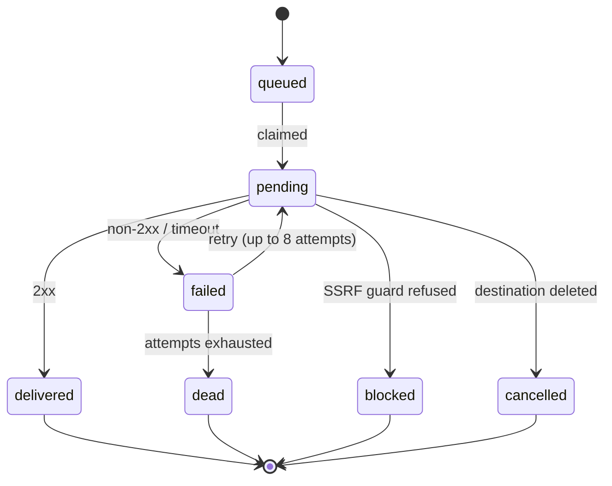

Once an event is captured, webhook.co can forward it to a **destination** — an org-level, HTTPS-only egress target you've allowlisted. You reference a destination by its `destinationId`, never by a free-form URL, and that's the design that makes outbound delivery SSRF-safe: the engine only ever sends to targets you registered and it re-validated. Delivery runs on a fixed retry schedule, and webhook.co re-signs an outgoing event only when it authenticated the source.

## Destinations are an allowlist

A destination is an entry in your org's egress allowlist: an HTTPS URL plus its config, addressed by `destinationId`. Because callers pass the id and not a URL, there's no code path where a crafted request talks the engine into hitting an arbitrary host. Two things put events on the wire:

- **Automatic delivery** via a [subscription](/guides/send-to-a-destination) — a binding from a source endpoint to a destination. Every matching event flows through automatically.
- **One-shot remote [replay](/guides/replay-past-or-failed-event)** — you pick a specific captured event and send it to a destination once.

Each destination has its own FIFO partition, so deliveries to one target stay ordered and a slow receiver can't reorder or block another destination's queue.

## Retry: the fixed exponential schedule

If a destination doesn't return `2xx`, the delivery is retried on a fixed schedule — up to **8 attempts**, with jittered waits between them:

| After attempt | Wait before next |
| ------------- | ---------------- |
| 1             | 5 seconds        |
| 2             | 5 minutes        |
| 3             | 30 minutes       |
| 4             | 2 hours          |
| 5             | 5 hours          |
| 6             | 10 hours         |
| 7             | 10 hours         |

Each wait carries ±10% jitter so a fleet of deliveries to a recovering host don't all re-fire in lockstep. That's roughly 32 hours of trying before attempt 8 exhausts and the delivery is dead-lettered — retained, so you can inspect and manually replay it. If a destination racks up **20 consecutive dead deliveries**, it's auto-disabled (recorded in your audit log, and the org owner is emailed); re-enable it to resume. A background reconciler re-wakes any delivery that got stranded mid-flight.

The full status vocabulary: `queued` (durably accepted, not yet tried), `forwarded`, `pending` (in flight), `delivered` (a `2xx`), `failed` (retryable), `blocked` (an SSRF/private target — terminal), `dead` (retries exhausted), and `cancelled` (the destination was deleted while the delivery was still open).

## The SSRF guard

`blocked` is terminal for a reason. Before every attempt the engine re-validates the destination URL, resolves its A/AAAA records over DNS-over-HTTPS, and checks _every_ resolved address — not just the first. Any address that lands on a private or internal range is refused. The engine never follows redirects (a redirect is a classic way to pivot a trusted request onto an internal host) and every request runs under a 10-second timeout. A destination that resolves to something internal doesn't get delivered to; it gets `blocked`.

## Send-side signing

Signing outbound is opt-in per destination. Give a destination a `whsec_...` signing secret and webhook.co signs each delivery using the [Standard Webhooks](https://www.standardwebhooks.com) contract — but it's **verified-gated**: webhook.co signs an event only when it authenticated the source. An [`unattempted`](/concepts/inbound-verification) event is delivered **unsigned** even to a signing destination, because putting our signature on something we never checked would be a lie your receiver would trust.

A few details worth knowing:

- **`webhook-id`** is stable across every retry of a delivery, so your receiver can dedupe idempotently no matter how many attempts it takes.
- **Rotation has a grace window** — during it, both the old and new signatures are sent, so your receiver can adopt the new secret without dropping a single delivery.
- **Inbound provider signature headers are stripped** before re-signing, so a downstream receiver can't be confused by the original sender's signature riding along.

## Related

- [Send to a destination](/guides/send-to-a-destination) — create a destination and a subscription.
- [Sign outbound webhooks](/guides/sign-outbound-webhooks) — add a signing secret and rotate it.
- [Handle delivery failures](/guides/handle-delivery-failures) — dead letters, auto-disable, and replay.
