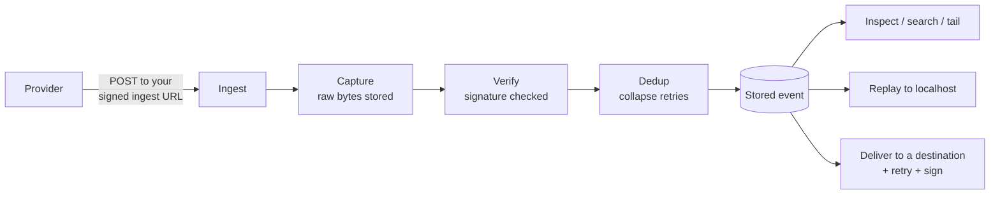

Every webhook that reaches webhook.co follows the same path: it is **captured** the instant it arrives, then **verified**, **deduplicated**, and **stored** — and from there you can **inspect** it, **replay** it to your machine, or **deliver** it onward to a destination. Capture happens first and unconditionally, so a request is never lost while the later steps run.

## Capture is the floor

The first thing webhook.co does with a request is store its exact bytes. Verification, deduplication, and delivery all run _after_ that durable capture — so a malformed signature, an unknown provider, or a downstream hiccup can never cost you the event. Everything else is something you can re-run against a payload that is already safely stored.

## The steps

- **Ingest.** Requests arrive at a free, permanent, signed [ingest URL](/concepts/ingest-urls) on a dedicated, cookieless apex. Every HTTP verb is accepted, and provider [verification handshakes](/guides/verify-inbound-signatures) are answered automatically.
- **Verify.** If you've registered a signing secret for a provider, the signature is checked against the captured bytes and the event is marked with its [verification state](/concepts/inbound-verification). Verification is best-effort — it never blocks capture, and an event can be verified retroactively.
- **Dedup.** [Deduplication](/deduplication) collapses a sender's retries into the single event you already captured. It's off by default, so you see every request while you get set up.
- **Store.** The event — raw body, normalized headers, method, provider, and verification result — is kept so you can inspect, search, tail, and replay it at any time.
- **Deliver.** Forward events to a [destination](/concepts/delivery-retry-signing) with at-least-once delivery, the fixed exponential retry schedule, and optional [Standard Webhooks](https://www.standardwebhooks.com/) signing on the way out.

## One product, four surfaces

Everything above is reachable identically from the **CLI, the API, the dashboard, and MCP**. A capability that exists on one exists on all — the same request shapes, the same results — so you can script it, click it, or hand it to an agent without learning four different products. The [MCP webhook → agent trigger](/mcp/wake-an-agent) extends the same model to autonomous agents: an inbound webhook can wake one up.