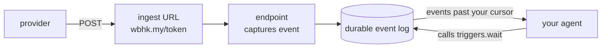

A trigger is a **durable subscription to one endpoint, plus a cursor**. Your agent asks for what it hasn't seen yet; we hold everything until it does.

That's the whole idea. Three properties fall out of it, and they're the reason to use one instead of polling `events.list` yourself:

- **You can't miss an event.** It's stored the moment it lands, whether or not your agent is running.
- **You can't process one twice.** The cursor only moves when you say so.
- **You can't be fooled.** Events that failed signature verification are never handed to you.

## How it runs



Capture is ours: it happens the instant a request lands. Consumption is yours: it happens when your agent calls. Note which way the last arrow points — it starts at your agent.

<Warning>
  **Nothing calls your agent.** `triggers.wait` is a short poll. webhook.co never opens a connection
  to your agent, starts a session, or interrupts one. An idle MCP client receives nothing, no matter
  how many webhooks arrive — they queue up durably and wait to be asked for. If you POST to your
  ingest URL and nothing happens, this is why: something has to be running the loop below.
</Warning>

## 1. Register the trigger

`triggers.create` needs the `triggers:write` scope and an endpoint id. A trigger covers the **whole endpoint** — there's no event-type filter:

```json
{
  "name": "triggers.create",
  "arguments": {
    "endpointId": "9f2c8b1e-0d3a-4c5e-8f7a-1b2c3d4e5f60",
    "name": "deploy-on-push"
  }
}
```

It returns a trigger record with an `id`. That id is durable — the subscription outlives any single agent process. Register once; consume from anywhere.

## 2. Run the loop

Your agent calls `triggers.wait`, acts on what comes back, then passes `nextCursor` forward. The cursor _is_ the acknowledgement — advance it only after the work is done, and a crash re-reads instead of dropping.

```ts
let cursor: string | null = null; // null = start from the oldest retained event

while (true) {
  const { events, nextCursor, caughtUp } = await mcp.call("triggers.wait", {
    triggerId: "…",
    cursor,
    limit: 50,
  });

  for (const event of events) {
    await handle(event); // dedup on event.id — delivery is at-least-once
  }

  cursor = nextCursor; // ack only after the work above succeeded
  if (caughtUp) await sleep(1000); // drained; nothing new right now
}
```

While `caughtUp` is false you're draining a backlog — call again promptly. Once it's true you're at the head, and how fast you react is now just how often you call. The exact contract — cursors, ordering, at-least-once, body inlining — is on [trigger semantics](/mcp/trigger-semantics).

## Why this is safe to hand an agent

`triggers.wait` creates **no outbound egress**. It's read-consumption of events the caller can already read — the same data as `events.list`, but tracked. That's exactly why triggers are exposed over MCP when [`subscriptions.*` and `replayDestinations.*` are not](/mcp/overview): those redirect where an org's events _go_, an egress decision an agent must never make. Reading your own events steers nothing.

<Card title="Trigger semantics" icon="book" href="/mcp/trigger-semantics">
  Cursors, at-least-once, ordering, body limits, and the API mirror.
</Card>
