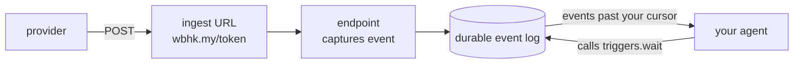

Most webhook-over-MCP tooling makes an agent ask "what happened?" and hands it a snapshot it has to diff. A trigger replaces that with a **durable subscription and a cursor**: your agent asks only for what it hasn't seen, gets the verified payload inline, and acknowledges by cursor — so an event is never processed twice and never silently skipped.

Two steps: register a webhook-to-agent trigger for an endpoint, then run a loop that consumes events from it.

<Warning>
  **Your agent does the waking.** `triggers.wait` is a short poll: webhook.co never calls out to
  your agent, opens a stream, or starts a session. An MCP client sitting idle is never woken, no
  matter how many webhooks land — the events queue up durably and wait for a call. If you POST to
  your ingest URL and nothing happens, this is why: something has to be running the loop below.
</Warning>

## The model



Note which way the arrow points at the end: the last hop starts at **your agent**. Capture is ours and happens the instant a request lands; consumption is yours and happens when you call.

A trigger is a durable webhook-to-agent subscription over an endpoint you can already read. Once it exists, an agent drains events from it with `triggers.wait` and acts on each one.

## Register the trigger

`triggers.create` needs the `triggers:write` scope and an endpoint id:

```json
{
  "name": "triggers.create",
  "arguments": {
    "endpointId": "9f2c8b1e-0d3a-4c5e-8f7a-1b2c3d4e5f60",
    "name": "deploy-on-push"
  }
}
```

It returns a trigger record with an `id`. That id is durable — the subscription outlives any single agent process. Register once; consume from anywhere.

## The agent loop

The agent calls `triggers.wait`, acts on what comes back, and passes `nextCursor` forward. The cursor _is_ the acknowledgement — persist it only after the work is done, and a crash re-reads rather than drops.

```ts
let cursor: string | null = null; // null = start from the oldest retained event

while (true) {
  const { events, nextCursor, caughtUp } = await mcp.call("triggers.wait", {
    triggerId: "…",
    cursor,
    limit: 50,
  });

  for (const event of events) {
    await handle(event); // dedup on event.id — delivery is at-least-once
  }

  cursor = nextCursor; // ack only after the work above succeeded
  if (caughtUp) await sleep(1000); // drained; idle until the next event
}
```

While `caughtUp` is false you're draining a backlog — re-invoke promptly. Once it's true, you've reached the head; wait on your own cadence. `triggers.wait` returns immediately with whatever is past the cursor, so this is a short-poll consume, not a blocking push. The exact contract — cursors, ordering, at-least-once, body inlining — is on [trigger semantics](/mcp/trigger-semantics).

## Why this is safe to hand an agent

`triggers.wait` creates **no outbound egress**. It's read-consumption of events the caller can already read — the same data as `events.list`, delivered event-first instead of asked-for. That's exactly why triggers are exposed over MCP when [`subscriptions.*` and `replayDestinations.*` are not](/mcp/overview): those redirect where an org's events _go_, an egress decision an agent must never make. Being woken by your own events steers nothing.

<Card title="Trigger semantics" icon="book" href="/mcp/trigger-semantics">
  Cursors, at-least-once, ordering, body limits, and the API mirror.
</Card>
